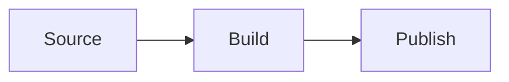
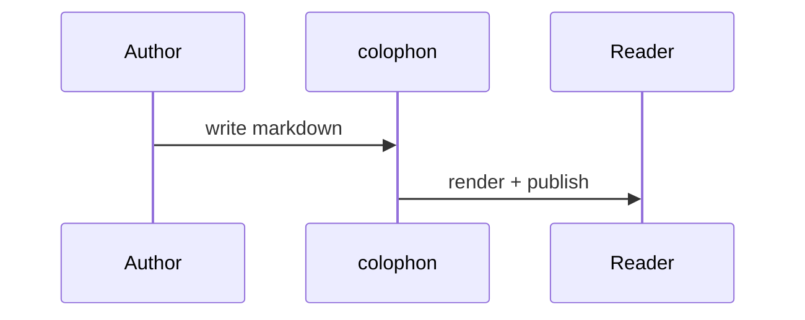

A built-in reference, rendered from markdown embedded in colophon itself — it is
not a file in your content and is never published. Run `colophon serve --showcase`
to view it in your active theme. Each section shows the **source** first, then how
it **renders**. (Media/links here point at placeholder paths — they won't load, but
the rendering is real.)

## Frontmatter

Every field a post can set. Only `title` is really required; the rest are optional.

```yaml
---
title: My Post                  # required
slug: my-post                   # override the URL slug (defaults from the filename)
date: 2026-01-15
author: jmylchreest             # an authors/*.yaml id
persona: default                # a hidden writing voice (personas/*.yaml)
tags: [meta, demo]
draft: false                    # true → built only in draft-including environments
publish: true                   # source-level publish flag (e.g. Obsidian)
type: post                      # post | page | <custom> — selects template + placement
lang: en                        # BCP-47; overrides the site language for this post

hero: "gen:a lighthouse at dusk"   # banner: a path, [[embed]], or gen: prompt
hero_alt: A lighthouse at dusk
hero_fit: cover                    # cover | contain | …
hero_position: center

image: assets/card.png             # social/preview image (og:image + index thumb)
image_alt: Preview card
image_fit: cover
image_position: top

audio: true                        # generate a spoken reading (default-on if speech is set)
audio_file: reading.mp3            # OR attach a pre-recorded file instead (wins over audio)
audio_voice: "<voice id>"          # override the voice for this post
speech_profile: minimax            # pick a named speech profile
image_profile: poster              # pick a named image profile

predecessor: part-one              # the previous post in a series (slug/filename)
series: "My Series"                # series title (latest-wins across the chain)

aliases: ["/old/url", "legacy-slug"]   # extra paths that 301 to this post
glossary: false                    # turn off automatic glossary decoration here

attachments:                       # downloadable files (see Attachments below)
  - { path: data.zip, label: "Dataset", feed: true }
---
```

## Headings

```markdown
# H1   ## H2   ### H3   #### H4   ##### H5   ###### H6
```

# Heading level 1
## Heading level 2
### Heading level 3
#### Heading level 4
##### Heading level 5
###### Heading level 6

## Text: emphasis and inline code

```markdown
**Bold**, *italic*, ***both***, ~~struck through~~, and `inline code`.
```

Renders as: **Bold**, *italic*, ***both***, ~~struck through~~, and `inline code`.

## Links

```markdown
An [external link](https://example.com), a bare autolink https://example.com,
and Obsidian wikilinks: [[note]], [[note|custom label]], [[note#a-heading]].
```

Renders as: An [external link](https://example.com), a bare autolink
https://example.com. (Wikilinks resolve against your own content, so only the
source is shown.)

## Lists

```markdown
- Unordered item
  - Nested item
- Another item

1. Ordered item
2. Second item

- [x] A finished task
- [ ] An unfinished task
```

Renders as:

- Unordered item
  - Nested item
- Another item

1. Ordered item
2. Second item

- [x] A finished task
- [ ] An unfinished task

## Blockquotes

```markdown
> A plain blockquote is rendered in italics, set off by a rule.
```

Renders as:

> A plain blockquote is rendered in italics, set off by a rule.

## Pull-quotes (lift a line into a statement)

For a full-width epigraph with an attribution — to *lift a section into a quote* —
use a `[!quote]` callout. The text after `[!quote]` becomes the attribution; leave
it blank for an unattributed pull-quote.

```markdown
> [!quote] Antoine de Saint-Exupéry
> Perfection is achieved, not when there is nothing more to add, but when there is nothing left to take away.
```

Renders as:

> [!quote] Antoine de Saint-Exupéry
> Perfection is achieved, not when there is nothing more to add, but when there is nothing left to take away.

And with no attribution:

```markdown
> [!quote]
> Keep it short. Keep it clear. Then cut it again.
```

> [!quote]
> Keep it short. Keep it clear. Then cut it again.

## Callouts (admonitions)

Obsidian-style callouts. The first line is `[!type] Title`; the body is markdown.
`note`, `tip` and `warning` have distinct styling; any other type renders in the
default box.

```markdown
> [!note] A note
> Body supports **markdown**, `code`, and links.

> [!tip] A handy tip
> Keep pronunciation dictionaries small.

> [!warning] Careful
> This action can't be undone.

> [!info] Any other type
> Falls back to the default callout style.
```

Renders as:

> [!note] A note
> Body supports **markdown**, `code`, and links.

> [!tip] A handy tip
> Keep pronunciation dictionaries small.

> [!warning] Careful
> This action can't be undone.

> [!info] Any other type
> Falls back to the default callout style.

## Code blocks

Fence with a language for highlighting; in spoken readings a code block becomes a
short cue ("a Go code example") rather than being read aloud.

````markdown
```go
func main() {
    fmt.Println("hello, colophon")
}
```
````

Renders as:

```go
func main() {
    fmt.Println("hello, colophon")
}
```

## Tables

```markdown
| Provider   | Inline dict | Remote dict |
|------------|:-----------:|------------:|
| MiniMax    |      ✓      |           — |
| ElevenLabs |      —      |           ✓ |
```

Renders as:

| Provider   | Inline dict | Remote dict |
|------------|:-----------:|------------:|
| MiniMax    |      ✓      |           — |
| ElevenLabs |      —      |           ✓ |

## Math (KaTeX)

```markdown
Inline $E = mc^2$, and display:

$$\int_0^1 x^2 \, dx = \tfrac{1}{3}$$
```

Renders as: Inline $E = mc^2$, and display:

$$\int_0^1 x^2 \, dx = \tfrac{1}{3}$$

## Diagrams (Mermaid)

````markdown

````

Renders as:


A sequence diagram, to show another Mermaid type:



## Images

A path or `[[embed]]`, or an AI-generated image from a `gen:` prompt
(content-addressed and cached). `?aspect=` and `?systemprompt=` tune a `gen:` image.

```markdown

![[screenshot.png|alt text]]

```

The third form rendered — the actual `gen:` image colophon produced from that prompt:


## Video

No new syntax — a markdown image embed pointing at a video file renders a player.
Video: `.mp4`, `.webm`, `.mov`, `.m4v`, `.ogv`.

```markdown

![[demo.webm]]
   <!-- external URLs play, untouched -->
```

Renders as (a real embedded, MiniMax-generated clip — no audio):


## Audio (inline)

The same embed pointing at an audio file renders an `<audio>` player. Audio:
`.mp3`, `.m4a`, `.aac`, `.oga`, `.ogg`, `.wav`, `.flac`, `.opus`. This is separate
from `audio:`/`audio_file:`, which attach a whole-post spoken reading.

```markdown

```

Renders as (a real embedded clip plays):


## Attachments (downloads)

Listed in frontmatter; colophon copies/routes each file like an image and renders a
**Downloads** block with size and filetype badge. `feed: true` also emits it as a
feed enclosure.

```yaml
---
attachments:
  - changelog.txt                                   # label = file name
  - { path: build.sh, label: "Build script", description: "Sets up the toolchain" }
  - { path: dataset.zip, label: "Dataset", feed: true }
---
```

## Glossary terms and abbreviations

When a project ships a `glossary.yaml`, the first mention of each term gets an
accessible pop-over. This page registers TTS, IPA, PCM and KaTeX as glossary terms
(under `--showcase`), so each is decorated where it first appears above. You can also
force an abbreviation inline.

A term may also carry **reference links**. These render as citation-style
superscripts right after the term — a single link shows a `↗` glyph, several show
numbers (`¹ ²`) — and the pop-over lists them as a numbered legend. The links are real
anchors in the text, so they work without an interactive card. Here KaTeX has one
reference link and IPA has two; an entry written as a plain string (TTS, PCM) has none.

```yaml
# glossary.yaml — an entry is a bare definition, or a mapping with links
PCM: Pulse-Code Modulation — uncompressed digital audio samples.
IPA:
  definition: International Phonetic Alphabet — a precise pronunciation notation.
  links:
    - { label: IPA chart, url: "https://www.internationalphoneticassociation.org/content/ipa-chart" }
    - { label: Wikipedia, url: "https://en.wikipedia.org/wiki/International_Phonetic_Alphabet" }
```

```markdown
Force one with <abbr title="Text To Speech">TTS</abbr>.
```

Renders as: Force one with <abbr title="Text To Speech">TTS</abbr>.

## Controlling the spoken reading

Two inline tags steer text-to-speech without changing what readers see:

```markdown
<notts>This is shown but never spoken.</notts>
<tts>This is always read aloud, even inside a skipped block.</tts>
```

Frontmatter switches per post: `audio: false` silences a post, `audio_file:`
attaches a recording, `audio_voice:` overrides the voice, and `speech_profile:`
picks a provider profile.

## Horizontal rule

```markdown
---
```

Renders as:

---

That's the set. Copy any block above into a post; if something here looks wrong in a
given theme, that's the place to check the styling.
